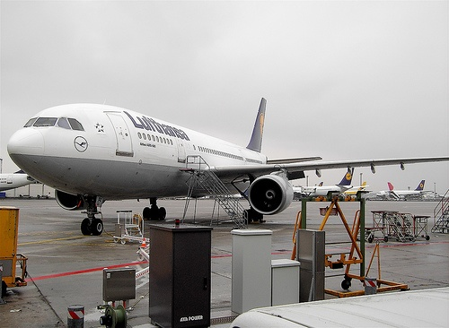
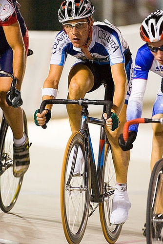
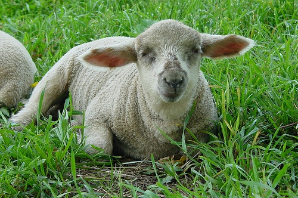
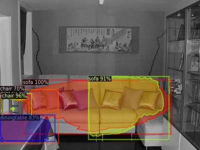
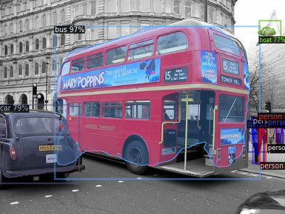
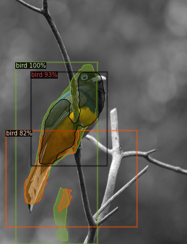

# Instance-segmentation-using-Detecron2
The purpose of this project is to implement a model for the task of instance segmentation using Tiny PASCAL VOC dataset. Detectron2 platform is used for this task. In particular, the model used is Mask R-CNN with ResNet50 as backbone. ImageNet pre-trained weights are used as a starting point for training.
The whole project is implemented using Google Colab platform.

## Environment

 ```
!pip install -U torch==1.5 torchvision==0.6 -f https://download.pytorch.org/whl/cu101/torch_stable.html
!pip install cython pyyaml==5.1
!pip install -U 'git+https://github.com/cocodataset/cocoapi.git#subdirectory=PythonAPI'
!pip install detectron2==0.1.3 -f https://dl.fbaipublicfiles.com/detectron2/wheels/cu101/index.html
  ```
  
## Dataset
We use Tiny PASCAL VOC dataset in this project, including 1349 training images and 100 test images.

------------------
<p align="center">
  
</p>

<p align="center">
  
</p>

<p align="center">
  
</p>

-------------------

To create your own dataset to fit Detectron2, you have to register your dataset (default is coco format) first:
```
register_coco_instances("train_pascal", {}, "/content/drive/My Drive/pascal_train.json", "/content/drive/My Drive/train_images")
register_coco_instances("test", {}, "/content/drive/My Drive/test.json", "/content/drive/My Drive/test_images")
```
## Train

Using the following commands to start the training process. To see more detailed steps, refer to instance_segmentation.ipynb.
```
trainer = DefaultTrainer(cfg)
trainer.resume_or_load(resume=False)
trainer.train() 
```

## Results
------------------
<p align="center">
  
  
  
</p>

-------------------

## Credits
1) https://colab.research.google.com/drive/16jcaJoc6bCFAQ96jDe2HwtXj7BMD_-m5#scrollTo=7unkuuiqLdqd
